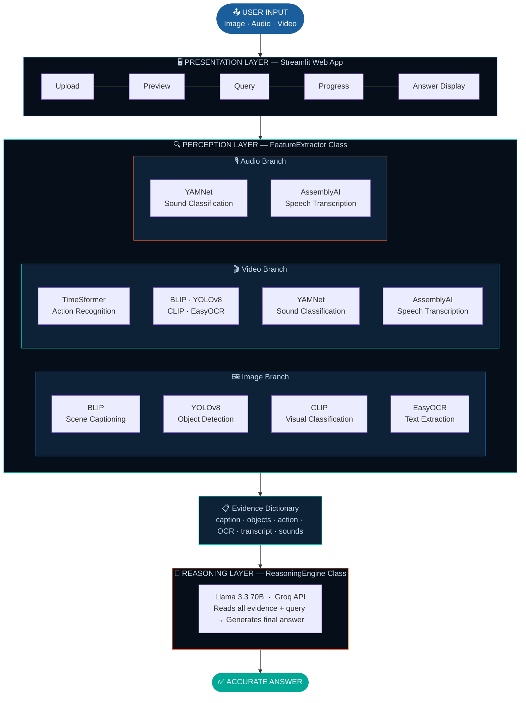

# 🧠 Multimodal QA System

> **Ask anything about any media. Get one accurate answer.**

A modular, end-to-end AI pipeline that accepts **images**, **audio**, and **video** as input and answers natural language queries by combining seven specialized perception models with a large language model reasoning engine — all within a clean Streamlit web interface.

---

## 📽️ Demo

| Input | Query | Answer |
|-------|-------|--------|
| 🎬 Domino's food review video | *"What is happening in the video?"* | *"The video shows a woman trying and reviewing new food items from Domino's, including Tandoori Veg Taco, Tandoori Loaded Chicken Parcel, saucy boneless chicken wings, and Cheese Lava Pizza..."* |
| 🖼️ BMW logo image | *"Which brand does that logo belong to?"* | *"The car brand is BMW."* |
| 🎙️ Audio recording | *"What sounds are present?"* | *"Speech, background music, and indoor ambience detected."* |

---

## ✨ Features

- 🖼️ **Image QA** — Caption generation, object detection, OCR, and vision-language classification
- 🎬 **Video QA** — Full visual pipeline + temporal action recognition + audio analysis
- 🎙️ **Audio QA** — Speech transcription + environmental sound classification
- 🔍 **Dynamic CLIP Classification** — Candidate labels generated by LLM based on your specific query
- 💡 **Transparent Pipeline** — Every intermediate output (caption, objects, OCR, sounds, action) is shown in real time
- ⚡ **Session Caching** — Models loaded once per session for fast repeated queries
- 🌐 **Streamlit Interface** — Clean, dark-themed single-page web app

---

## 🏗️ System Architecture

## 🏗️ System Architecture


---

## 🤖 Models Used

| Component | Model | Purpose |
|-----------|-------|---------|
| Scene Captioning | BLIP Large (`Salesforce/blip-image-captioning-large`) | Natural language scene description |
| Object Detection | YOLOv8m (`yolov8m.pt`) | Real-time object identification |
| Visual Classification | CLIP ViT-L/14 (`openai/clip-vit-large-patch14`) | Query-driven zero-shot classification |
| Text Extraction | EasyOCR | OCR from images and video frames |
| Action Recognition | TimeSformer (`facebook/timesformer-base-finetuned-k400`) | Temporal video action classification |
| Sound Classification | YAMNet (`google/yamnet/1`) | Environmental sound tagging |
| Speech Transcription | AssemblyAI Universal-3-Pro / Universal-2 | Automatic speech recognition |
| Reasoning Engine | Groq LLaMA-3.3-70B-Versatile | Multimodal evidence synthesis |

---

## 📊 Evaluation Results (Zero-Shot)

| Modality | Benchmark | Metric | Our Pipeline | Baseline |
|----------|-----------|--------|-------------|----------|
| Image QA | VQAv2 | VQA Accuracy | **31.00%** | Frozen: 29.50% |
| Video QA | ActivityNet-QA | Top-1 Accuracy | **50.00%** | FrozenBiLM: 25.90% |
| Video QA | ActivityNet-QA | BERTScore-F1 | **96.72%** | — |
| Sound Classification | ESC-50 | Top-3 Accuracy | **60.00%** | AST: 74.00% |
| Speech Recognition | LibriSpeech | WER ↓ | **2.14%** | Whisper-base: 4.85% |

> All results are **zero-shot** — no fine-tuning on any evaluation dataset.

---

## 🚀 Getting Started

### Prerequisites

- Python 3.11 (as specified in `runtime.txt`)
- GPU recommended (CUDA-compatible) — CPU supported but slower
- [Groq API Key](https://console.groq.com) — for LLaMA-3.3-70B inference
- [AssemblyAI API Key](https://www.assemblyai.com) — for speech transcription

---

### Option 1: Run Locally

```bash
# Clone the repository
git clone https://github.com/vaibhavsimha-j/MultimodalQuestionAnsweringSystem.git
cd MultimodalQuestionAnsweringSystem

# Install system dependencies (Linux/Ubuntu)
sudo apt-get install ffmpeg libgl1

# Install Python dependencies
pip install -r requirements.txt

# Run the app
streamlit run app.py
```

Then open your browser at `http://localhost:8501`.

---

### Option 2: Deploy on Streamlit Cloud

This repository is fully configured for **Streamlit Community Cloud** deployment out of the box.

1. Fork this repository
2. Go to [share.streamlit.io](https://share.streamlit.io) and connect your GitHub account
3. Select this repo, set `app.py` as the main file, and click **Deploy**
4. System packages (`ffmpeg`, `libgl1`) and Python packages are installed automatically from `packages.txt` and `requirements.txt`

---

### Usage

1. Enter your **Groq API Key** and **AssemblyAI API Key** in the sidebar
2. Upload a media file — image, audio, or video
3. Type your natural language question in the query box
4. Click **Run** and watch the pipeline execute step by step in real time
5. Read your answer in the output box at the bottom

---

## 📁 Repository Structure

```
MultimodalQuestionAnsweringSystem/
│
├── app.py              # Main Streamlit application — full pipeline logic
├── requirements.txt    # Python package dependencies
├── packages.txt        # System-level dependencies (ffmpeg, libgl1)
└── runtime.txt         # Python version specification (python-3.11)
```

---

## 📦 Dependencies

### Python Packages — `requirements.txt`

```
tensorflow==2.16.1
tensorflow-hub==0.16.1
streamlit
torch
torchvision
ultralytics
transformers
easyocr
opencv-python-headless
librosa
moviepy==1.0.3
assemblyai
groq
```

### System Packages — `packages.txt`

```
ffmpeg
libgl1
```

> **`ffmpeg`** — Required by MoviePy for audio extraction from video files.  
> **`libgl1`** — Required by OpenCV for video frame processing.  
> **`opencv-python-headless`** — Used instead of `opencv-python` for server and cloud compatibility (no display required).

---

## 🧪 Supported File Formats

| Modality | Formats |
|----------|---------|
| 🖼️ Image | `jpg`, `jpeg`, `png`, `webp` |
| 🎬 Video | `mp4`, `avi`, `mov`, `mkv` |
| 🎙️ Audio | `mp3`, `wav`, `m4a`, `flac` |

---

## 🔬 How the Pipeline Works

### Image Input
```
Upload Image
    → BLIP       : Generate scene caption
    → YOLOv8     : Detect objects (confidence ≥ 0.5)
    → EasyOCR    : Extract readable text from image
    → LLM        : Generate 15 candidate labels from query + caption
    → CLIP       : Score image vs all candidates → pick best match
    → LLM        : Synthesize all evidence → Final Answer
```

### Video Input
```
Upload Video
    → MoviePy       : Extract audio track to temp MP3
    → AssemblyAI    : Transcribe speech content
    → YAMNet        : Classify top-3 environmental sounds (16kHz via Librosa)
    → OpenCV        : Sample 8 evenly-spaced frames via NumPy linspace
    → TimeSformer   : Recognize primary action across all 8 frames
    → BLIP          : Caption frames 0, 3, 7
    → YOLOv8        : Detect objects across all 8 frames (deduplicated)
    → EasyOCR       : Extract text from frames 0, 3, 7
    → CLIP          : Compute embeddings per frame, average logits → best label
    → LLM           : Synthesize all evidence → Final Answer
```

### Audio Input
```
Upload Audio
    → AssemblyAI    : Transcribe spoken content
    → YAMNet        : Classify top-3 environmental sound categories
    → LLM           : Synthesize transcript + sounds → Final Answer
```

---

## 🌟 Key Design Decisions

- **Specialist over Generalist** — Each perception task is assigned to a dedicated model trained specifically for that purpose, not a single generalist architecture
- **Dynamic CLIP Candidates** — Before every CLIP inference, the LLM generates 15 query-specific candidate labels from the user's query and the BLIP caption, making classification always contextually relevant
- **Transparent Outputs** — All intermediate evidence fields (caption, detected objects, action label, OCR text, transcript, sound profile) are exposed in real time via Streamlit's `st.status` widget
- **Zero-Shot Operation** — No fine-tuning required; works on arbitrary real-world media out of the box without any task-specific training
- **Session Caching** — All models are loaded once via `@st.cache_resource` and reused across queries, significantly reducing per-query latency
- **Headless OpenCV** — Uses `opencv-python-headless` for cloud and server compatibility without display dependencies
- **Automatic Temp File Cleanup** — All temporary files (extracted audio, OCR frame images) are deleted with `os.remove` after each analysis cycle

---

## 🔑 API Keys

| Service | Purpose | Get Key |
|---------|---------|---------|
| **Groq** | Serves Llama 3.3 70B for candidate label generation and final answer synthesis | [console.groq.com](https://console.groq.com) |
| **AssemblyAI** | Universal-3-Pro / Universal-2 automatic speech recognition | [assemblyai.com](https://www.assemblyai.com) |

> Keys are entered securely via the sidebar and are never stored — they exist only within your active Streamlit session.

---

## 📚 References

| # | Paper / Resource |
|---|-----------------|
| [1] | Antol et al., *VQA: Visual Question Answering*, ICCV 2015 |
| [2] | Radford et al., *Learning Transferable Visual Models from Natural Language Supervision (CLIP)*, ICML 2021 |
| [3] | Li et al., *BLIP: Bootstrapping Language-Image Pre-training*, ICML 2022 |
| [4] | Jocher et al., *Ultralytics YOLOv8*, 2023 |
| [5] | Bertasius et al., *Is Space-Time Attention All You Need for Video Understanding? (TimeSformer)*, ICML 2021 |
| [6] | Gemmeke et al., *Audio Set*, ICASSP 2017 |
| [7] | Google, *YAMNet*, TensorFlow Hub 2020 |
| [8] | AssemblyAI, *Universal Speech Recognition API*, 2024 |
| [9] | Baek et al., *What Is Wrong With Scene Text Recognition Model Comparisons?*, ICCV 2019 |
| [10] | Meta AI, *The Llama 3 Herd of Models*, arXiv 2024 |

---

## 👨‍💻 Author

**Vaibhav Simha J**  
B.Tech CSE (AI & ML) — JAIN (Deemed-to-be University), Bangalore  
📧 22btrcl163@jainuniversity.ac.in

---

## 📄 License

This project was developed as a Final Year B.Tech project at JAIN (Deemed-to-be University). Feel free to explore, learn from, and build upon this work with appropriate attribution.

---

<p align="center">
  <b>Vision • Audio • Video • Intelligence</b><br/>
  <i>One system. Three modalities. Seven specialist models. One accurate answer.</i>
</p>
